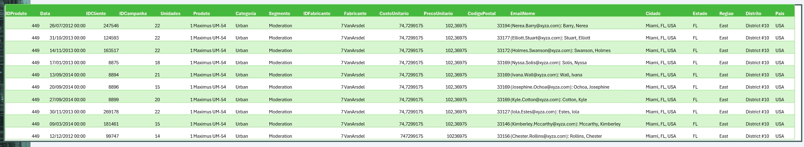
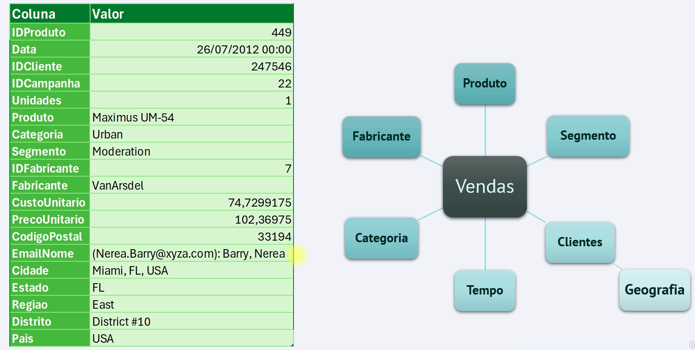

## Caso de Uso
***

* Análise de vendas detalhada por cliente, produto, fabricante, geografia, segmento e categoria.

* Medição de KPIs como total de vendas, variações diárias, mensais e anuais.

* Identificação de oportunidades de otimização e estratégias de crescimento com base nos dados analisados.

### Levantamento de Requisitos

* **Assuntos**: Analise de Vendas

* **Explicado por**: Cliente, produto, fabricante, geografia, segmento, categoria e tempo.

* **O que será mensurado**:

    - Total de vendas (qtd e R$)
    - Variações dia (qtd e R$)
    - Variações mês (qtd e R$)
    - Variação ano (qtd e R$)
    - Ticket Médio (qtd e R$)
    - Acumulado Year To Date YTD (qtd e R$)
    - Acumulado Month To Date MTD (qtd e R$)
    - Variação Acumulado YTD (qtd e R$)
    - Variação Acumulado MTD (qtd e R$)

### Amostragem dos dados

Pegar uma pequena amostra dos dados para fazer analise exploratória e entender os dados.

### Realizar uma modelagem conceitual

Faça uma modelagem dos dados baseados na arquitetura **Snow Flake**. É um **Star Scheme** com dimensões sobre dimensões, que é o caso da tabela **Geografia** que faz relacionamento com a dimensão **Clientes** e não diretamente a tabela fato **Vendas**.

### Definir a arquitetura

Vamos construir o **datalake** com uma arquitetura **Medallion**.

* **Landing Zone**: Onde os dados são armazenados de forma bruta, sem processamento adicional.

* **Bronze**: Onde os dados são pré-processados para a limpeza, deduplicação e desnormalização

* **Silver**: Onde os dados são enriquecidos, agregados e transformados em uma forma mais legível para relatórios e análises.

* **Gold**: Onde os dados são armazenados para análises em larga escala e geração de valor para a empresa.

